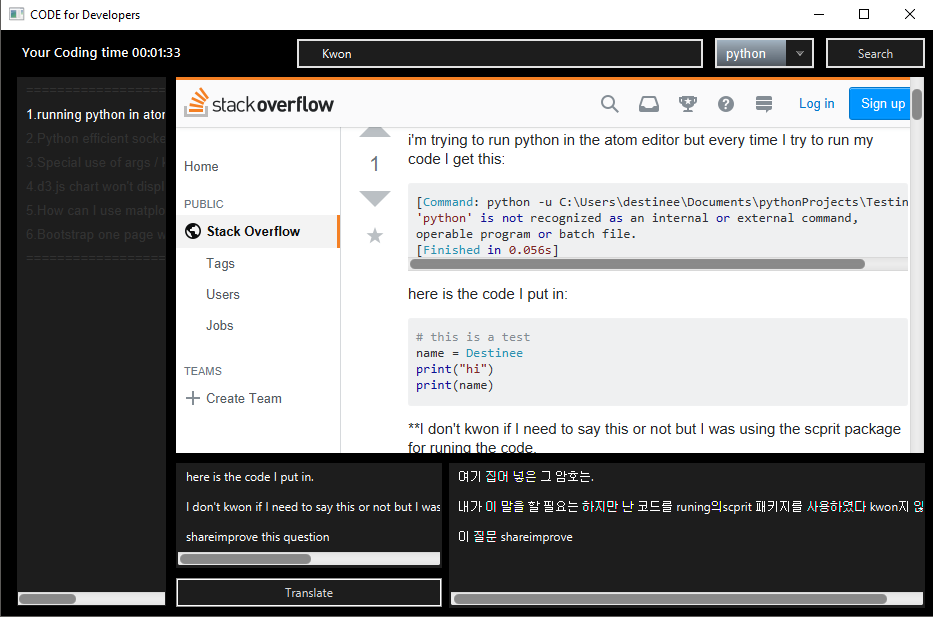
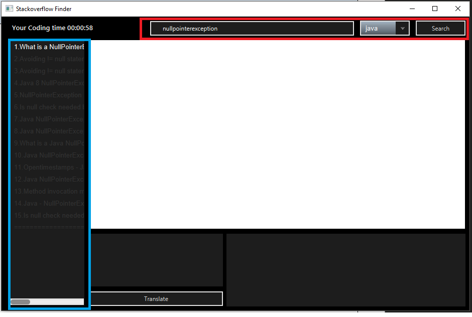
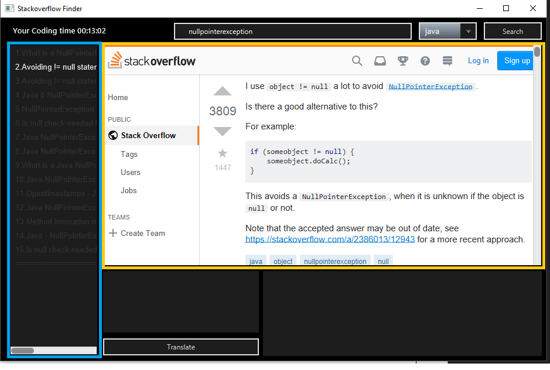
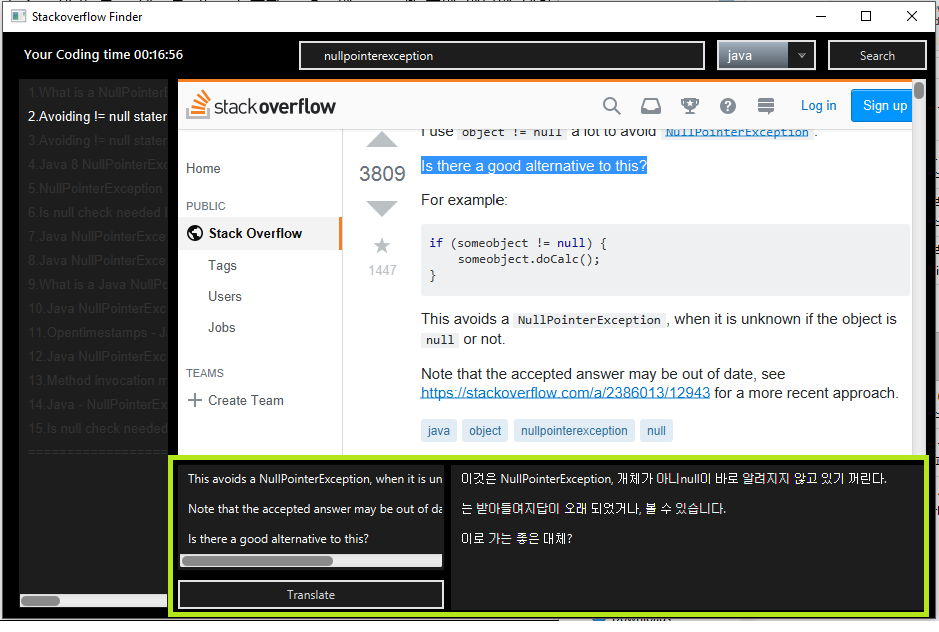
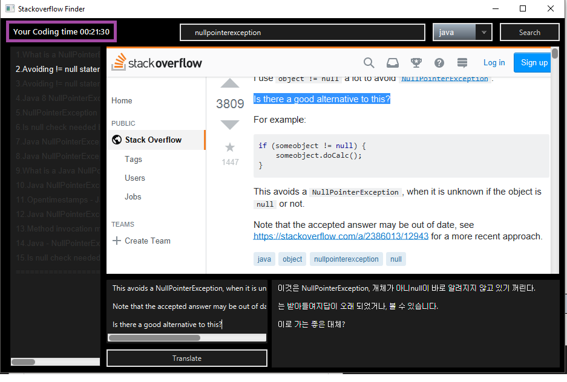

# 2019_Java_Project
### CODE for Developers

> 프로젝트 파일을 다운 받고, TranslatorText.java의 clientId, clientSecret 값에 네이버 Developers에서 파파고 NMT를 등록하고 발급받은 키를 입력합니다. 
>
> 다음, EXE4J로 export 하면 어플리케이션을 실행 파일 형태로 사용할 수 있습니다.

#### 1. 개발 동기

저는 개발을 좋아합니다. 그래서 평소에 코딩을 많이 하고 있습니다. 코딩을 하다 보면 에러가 발생할 때가 있고, 에러를 찾을 때 개발자 커뮤니티인 “Stack Over Flow”를 이용합니다. 사이트를 이용하면서 에러가 뜰 때 마다 브라우저를 열어서 찾는 것, 모르는 부분이 있으면 번역기를 열어서 검색하는 것, 검색하다 보면 어느새 탭이 10개, 20개 열려 있는 것이 매번 번거로웠습니다. 그래서 개발자에게 도움이 될 수 있는 어플리케이션을 만들기로 하였고, 이러한 동기로 만들게 된게 “CODE for Developers”입니다. 

#### 2. 설명

개발자를 위한 프로그램으로, 코딩을 한 시간을 알려주고, 에러가 뜬 경우 에러를 검색하면 에러를 찾아주고, 찾은 에러 검색 결과에서 번역이 필요한 부분이 있으면 번역을 해주는 개발자에게 도움을 줄 수 있는 프로그램입니다. 

#### 3. 어플리케이션 기능, 작동 과정

1. 기능 1 : 프로그램 에러 검색 기능

프로그래밍 언어를 선택하고, 에러 내용을 적습니다. 예를 들어 java 프로그래밍을 하는 중 “nullpointerexception”이라는 에러 코드가 생기면 코드를 텍스트 필드에 붙여 넣어 “Stack Over Flow” 사이트에서 에러 Q&A를 검색하여 정보를 찾고 (붉은색 영역), 검색 결과를 왼쪽 리스트에서 볼 수 있습니다 또한 검색 결과는 누적됩니다. (파란색 영역).  

2. 기능 2 : 에러 표현 기능

검색 리스트에서 보고싶은 부분을 클릭합니다. 클릭하면 웹 뷰로 연결되며, 에러에 대한 “Stack Over Flow” Q&A 검색 결과를 웹 페이지로 볼 수 있습니다. (푸른색 영역에 있는 리스트 중 검색하고 싶은 내용을 고르면 주황색 영역에 있는 웹 뷰에 에러에 대한 페이지 내용이 나타납니다) 

3. 기능 3 : 번역 기능

찾은 내용에서 이해하기 어려운 부분이 있으면 번역시스템을 이용할 수 있습니다. (초록색 영역의 왼쪽 부분에 번역하고자 하는 내용을 복사하여 붙여 넣으면 오른쪽 부분에서 번역 결과를 볼 수 있습니다) 

4. 기능 4 : 코딩 시간 측정 기능

코딩을 얼마나 했는지 시간을 보여줍니다. 코딩을 할 때 어플리캐이션을 실행해두면 코딩을 얼마나 했는지 좌측 상단 보라색 영역에서 볼 수 있습니다. 

